# 🔐 Secure File Upload Portal

This project is a **Secure File Intake Gateway** built with Django. Unlike standard upload applications, it is engineered with a strict **Defense-in-Depth** architecture to safely accept, analyze, and neutralize untrusted files before they are made available to users.

---

## 🏗 Architecture Overview

The system employs a multi-stage pipeline where every file is treated as hostile until proven otherwise.

```mermaid
graph LR
    User([User]) -->|Upload| Quarantine[🔒 Quarantine Storage]
    Quarantine -->|Stream Scan| ClamAV[🦠 ClamAV Scanner]
    ClamAV -- Infected --> Reject[❌ Reject & Log]
    ClamAV -- Clean --> CDR[🛠 Content Disarm & Reconstruction]
    CDR -->|Sanitized| CleanStore[✅ Clean Storage]
    CleanStore -->|Auth Download| AuthUser([Authorized User])
```



### Defense in Depth
No single control is trusted completely.
1.  **Isolation**: Files land in a directory that cannot be served by the web server.
2.  **Detection**: Signature-based scanning catches known threats.
3.  **Sanitization**: CDR neutralizes unknown threats (zero-days) in metadata.
4.  **Access Control**: Files are only accessible via authenticated application logic, not direct links.

---

## 🛡 Implemented Security Controls

### 1. Malware Scanning
- **ClamAV Integration**: Uses `pyclamd` to stream files to a local ClamAV daemon.
- **Fail-Closed Logic**: If the scanner is offline, uploads are rejected (security > availability).
- **Proactive**: Scanning occurs *before* the file is moved to permanent storage or a database record is finalized.

### 2. Quarantine & State Machine
- **State Enforcement**: The `UploadedFile` model enforces a strict state machine (`PENDING` → `CLEAN` or `REJECTED`).
- **Physical Isolation**: Files are initially saved to `media/quarantine/`, a location successfully isolated from the `media/uploads/` directory.
- **Atomic Promotion**: Only files that pass all checks are moved to the clean directory.

### 3. Content Disarm & Reconstruction (CDR)
We assume antivirus might miss zero-day exploits. CDR reconstructs files to destroy hidden payloads.
- **Images (Pillow)**: Images are re-encoded (e.g., loaded and saved as new pixels), stripping potentially malicious EXIF metadata (GPS, Camera ID) and non-pixel payloads.
- **PDFs (pypdf)**: PDF structures are parsed and rewritten to linearize content and remove appended malicious scripts.
- **Disclaimer**: CDR may cause minor fidelity loss (e.g., metadata removal), which is an intentional security trade-off.

### 4. Protected Media Storage
- **No Direct Access**: The web server’s static/media routing is configured to **ignore** the upload directory.
- **Authenticated Gateway**: Files are served exclusively through a Django view (`download_file`) which verifies:
    1.  User is logged in.
    2.  User has permission (extensible).
    3.  File status is explicitly `CLEAN`.
- **Identity Separation**: Files are stored on disk using **random UUIDs** to prevent collisions and guesswork, but are served to the user with their **Original Filename** for better UX.

### 5. Security Logging
- **Audit Trail**: A dedicated `SecurityEvent` model tracks critical security interactions.
- **Forensics**: Logs identifying information (IP, User, Timestamp) for:
    - `MALWARE_DETECTED`: Attempts to upload known viruses.
    - `DOWNLOAD`: Who accessed which file and when.

---

## 🎨 UI/UX

The interface has been designed to reflect a "Secure Intake Gateway" rather than a standard web app.

- **Theme**: High-contrast Dark Mode for enterprise environments.
- **Visual Cues**: Clear status indicators (`PENDING` = Yellow, `CLEAN` = Green, `REJECTED` = Red).
- **Usability**: Files are uploaded via a secure drag-and-drop zone and listed with their sanitized original names.


---

## 🧪 Testing & Verification

The project includes a comprehensive test suite (`uploads/tests.py`) verifying security controls:

- **Automated Tests**:
    - Verifies valid files are processed and moved to clean storage.
    - Verifies malware (EICAR signatures) is rejected and logged.
    - Verifies scanner downtime triggers rejection (Fail-Closed).
    - Verifies unauthenticated users cannot access downloads.
- **Manual Verification**:
    - Supports safe testing using the EICAR test file string.

---

## ⚙️ Deployment Requirements

### Prerequisites
- Python 3.10+
- **ClamAV Daemon**: Must be installed and running (`clamd`).
- **Freshclam**: Virus definitions must be up to date.

### Installation & Run

1.  **Clone & Setup**:
    ```bash
    git clone https://github.com/Harshit-Maurya838/secure-file-upload-portal.git
    cd secure-file-upload-portal
    python -m venv venv
    source venv/bin/activate  # or venv\Scripts\activate on Windows
    pip install -r requirements.txt
    ```

2.  **Install System Dependencies (Linux/Debian)**:
    ```bash
    sudo apt-get install clamav clamav-daemon
    sudo freshclam
    sudo service clamav-daemon start
    ```

3.  **Database & Config**:
    ```bash
    python manage.py makemigrations
    python manage.py migrate
    ```

4.  **Run Server**:
    ```bash
    python manage.py runserver
    ```
    *Note: In production, ensure your web server (Nginx/Apache) does NOT serve the `media/` directory.*

---

## ⚠ Residual Risks & Future Work (For next Update)

While robust, this Tier 1 implementation has known scope limitations:
- **Signature Limitations**: ClamAV only detects known threats.
- **Complex Formats**: CDR is currently limited to Images and PDFs. Office documents (`.docx`, `.xlsx`) require more complex parsing libraries.
- **Advanced Analysis**: No sandboxing (behavioural analysis) is performed.
- **DoS**: Large file uploads could still potentially exhaust resources (though Django limits are in place).

---

## 🎯 Security Philosophy

> "Trust Input? **Never.**"

This project operates on the principle that every byte of user-submitted data is a potential exploit. By layering validation, isolation, and reconstruction, we reduce the attack surface significantly compared to standard file handling libraries.

---

